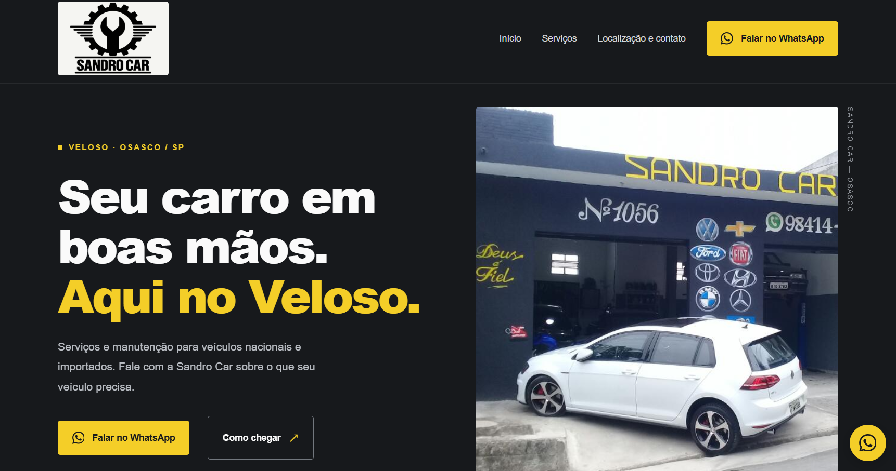
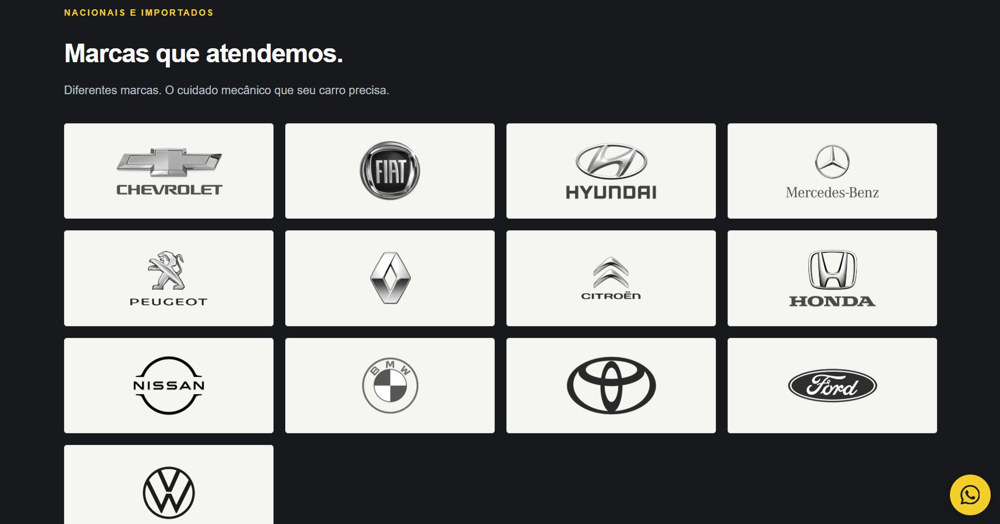
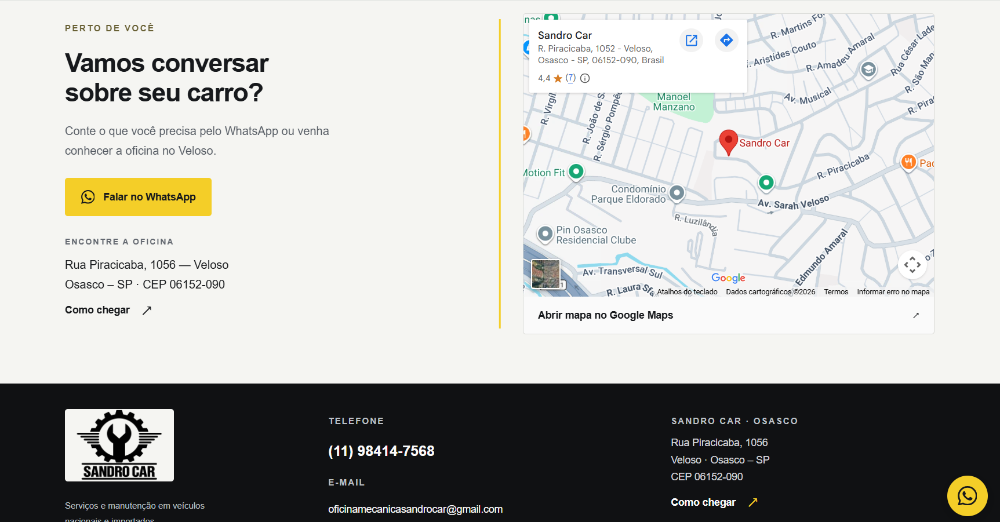

# 🚗 Sandro Car

### Site institucional para serviços automotivos

Site institucional desenvolvido para a **Sandro Car**, com foco na apresentação dos serviços automotivos, marcas atendidas e informações de contato por meio de uma experiência digital clara e organizada.

> Este repositório apresenta o projeto como parte do meu portfólio profissional.  
> O código-fonte original é mantido em um repositório privado.

---

## 🖥️ Visão do projeto

<p align="center">
  
</p>

---

## 📌 Sobre o projeto

O site da Sandro Car foi desenvolvido com o objetivo de fortalecer a presença digital da empresa e facilitar o acesso dos clientes às principais informações sobre seus serviços.

O projeto combina uma identidade visual voltada ao segmento automotivo com uma estrutura de conteúdo simples e objetiva.

O site apresenta informações como:

- 🚘 Serviços automotivos
- 🔧 Manutenção e revisão
- 🏷️ Marcas de veículos atendidas
- 📍 Localização e informações de contato
- 💬 Acesso direto aos canais de atendimento

---

## 👨‍💻 Minha atuação

Fui responsável pelo desenvolvimento e implementação do site, incluindo:

- Desenvolvimento front-end utilizando React
- Implementação da interface
- Organização do conteúdo e estrutura das páginas
- Estruturação da aplicação
- Estilização e ajustes visuais
- Configuração das informações e conteúdos do projeto
- Preparação do build utilizando Vite

---

## 🛠️ Tecnologias utilizadas

<p>
  
</p>

`React` • `JavaScript` • `CSS` • `Vite`

---

## 🔧 Serviços

Os principais serviços automotivos da Sandro Car são apresentados de forma organizada, facilitando a identificação das soluções oferecidas pela empresa.

<p align="center">
  
</p>

---

## 🚘 Marcas atendidas

O site possui uma seção dedicada às marcas de veículos atendidas pela empresa, permitindo que o cliente identifique rapidamente a compatibilidade com seu veículo.

<p align="center">
  
</p>

---

## 📍 Contato e localização

A área de contato concentra as principais informações necessárias para que o cliente encontre a empresa e entre em contato.

<p align="center">
  
</p>

---

## 🧩 Estrutura do projeto

A aplicação original foi desenvolvida utilizando React e Vite, com separação entre configuração, conteúdo e estilização.

```text
src/
├── App.jsx
├── config.js
├── content.js
├── main.jsx
└── styles.css

public/
└── images/

index.html
vite.config.js
```

A separação entre `config.js`, `content.js` e a aplicação principal facilita a organização das informações e futuras manutenções do projeto.

---

## 🔒 Sobre o código-fonte

Este repositório contém apenas a apresentação pública do projeto para fins de **portfólio profissional**.

O código-fonte completo é mantido em um **repositório privado**, preservando a implementação original do projeto.

---

## 👤 Desenvolvedor

**Lucas Oliveira**

Salesforce Marketing Cloud Consultant | Marketing Automation | Developer

[](https://www.linkedin.com/in/lucas-oliveira-7948b494/)
